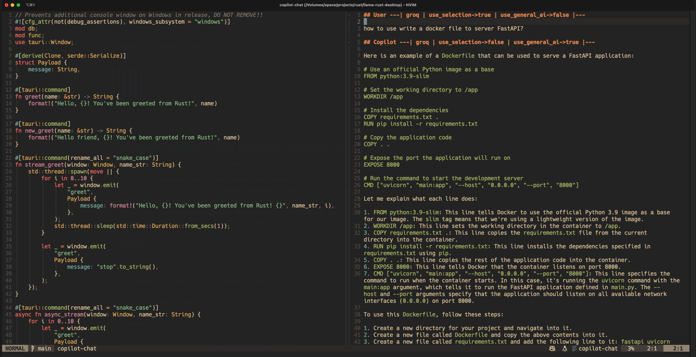

# CopilotChat For Neovim, add support for self-host API interface, including (Gemini Pro and Llama3<Groq>)

> forked from Copilotc-nvim -> [https://copilotc-nvim.github.io/CopilotChat.nvim/](https://copilotc-nvim.github.io/CopilotChat.nvim/)

## Prerequisites

Ensure you have the following installed:

- **Neovim stable (0.9.5) or nightly**.

Optional:

- tiktoken_core: `sudo luarocks install --lua-version 5.1 tiktoken_core`. Alternatively, download a pre-built binary from [lua-tiktoken releases](https://github.com/gptlang/lua-tiktoken/releases)
- You can check your Lua PATH in Neovim by doing `:lua print(package.cpath)`. Save the binary as `tiktoken_core.so` in any of the given paths.

## Add self host gpt server

> check [https://github.com/bruceunx/gpt-server]('https://github.com/bruceunx/gpt-server') to setup your Gemini or Groq server

- need to add the server URL in the configuration

## Installation

### Add support for AI like Gemini or Groq as long as the same API interfaces



#### change `gpt_server` to the server name

```bash
:lua require('CopilotChat').change_gpt("gemini")
```

#### Lazy.nvim config

```lua
return {
	"bruceunx/CopilotChat.nvim",
	branch = "canary",
	dependencies = {
		{ "zbirenbaum/copilot.lua" }, -- or github/copilot.vim
		{ "nvim-lua/plenary.nvim" }, -- for curl, log wrapper
	},

	opts = {
        debug = true, -- including debug information for new user to check the log
		question_header = "## User ",
		answer_header = "## Copilot ",
		error_header = "## Error ",
		separator = " ", -- Separator to use in chat
		prompts = prompts,
		auto_follow_cursor = false, -- Don't follow the cursor after getting response
		show_help = true, -- Show help in virtual text, set to true if that's 1st time using Copilot Chat
		gpt_server = "groq", -- copilot or gemini or groq
		copilot_url = "https://api.githubcopilot.com/chat/completions",
		gemini_url = "", -- custom url for gemini with the same api interface
		groq_url = "", -- custom url for groq with the same api interface
	},
	config = function(_, opts)
		local chat = require("CopilotChat")
		chat.setup(opts)
    end,
}
```

#### Add Change `gpt_server` key bindings

> user can add in above config

```lua
    {
        "<leader>ac",
        function()
            local input = vim.fn.input("Change gpt_server: 1 - Copilot, 2 - Gemini, 3 - Groq \n")
            if input ~= "" then
                if input == "1" then
                    require("CopilotChat").change_gpt("copilot")
                elseif input == "2" then
                    require("CopilotChat").change_gpt("gemini")
                else
                    require("CopilotChat").change_gpt("groq")
                end
            end
        end,
        desc = "CopilotChat - change gpt server",
    },
```

### Add suppress selection when using Copilot Chat

> if you just want to chat without the current bufffers. you can suppress the selection

```lua
    {
        "<leader>as",
        function()
            local input = vim.fn.input("Use selection: 1 - use, 2 - no \n")
            if input ~= "" then
                if input == "1" then
                    require("CopilotChat").use_selection(true)
                else
                    require("CopilotChat").use_selection(false)
                end
            end
        end,
        desc = "CopilotChat - Suppress selection",
    },
```

### Same Logic to use **General AI System Prompt**

> if you want to chat with general questions, suppress the default Copilot System Prompt.

```lua
    {
        "<leader>ag",
        function()
            local input = vim.fn.input("Use general: 1 - use, 2 - no \n")
            if input ~= "" then
                if input == "1" then
                    require("CopilotChat").use_general_ai(true)
                else
                    require("CopilotChat").use_general_ai(false)
                end
            end
        end,
        desc = "CopilotChat - Use General AI System Prompt",
    },
```

See @jellydn for [configuration](https://github.com/jellydn/lazy-nvim-ide/blob/main/lua/plugins/extras/copilot-chat-v2.lua)

### Vim-Plug

Similar to the lazy setup, you can use the following configuration:

```vim
call plug#begin()
Plug 'zbirenbaum/copilot.lua'
Plug 'nvim-lua/plenary.nvim'
Plug 'CopilotC-Nvim/CopilotChat.nvim', { 'branch': 'canary' }
call plug#end()

lua << EOF
require("CopilotChat").setup {
  debug = true, -- Enable debugging
  -- See Configuration section for rest
}
EOF
```

### Manual

1. Put the files in the right place

```
mkdir -p ~/.config/nvim/pack/copilotchat/start
cd ~/.config/nvim/pack/copilotchat/start

git clone https://github.com/zbirenbaum/copilot.lua
git clone https://github.com/nvim-lua/plenary.nvim

git clone -b canary https://github.com/CopilotC-Nvim/CopilotChat.nvim
```

2. Add to your configuration (e.g. `~/.config/nvim/init.lua`)

```lua
require("CopilotChat").setup {
  debug = true, -- Enable debugging
  -- See Configuration section for rest
}
```

See @deathbeam for [configuration](https://github.com/deathbeam/dotfiles/blob/master/nvim/.config/nvim/lua/config/copilot.lua#L14)

## Usage

### Commands

- `:CopilotChat <input>?` - Open chat window with optional input
- `:CopilotChatOpen` - Open chat window
- `:CopilotChatClose` - Close chat window
- `:CopilotChatToggle` - Toggle chat window
- `:CopilotChatReset` - Reset chat window
- `:CopilotChatSave <name>?` - Save chat history to file
- `:CopilotChatLoad <name>?` - Load chat history from file
- `:CopilotChatDebugInfo` - Show debug information

#### Commands coming from default prompts

- `:CopilotChatExplain` - Write an explanation for the active selection as paragraphs of text
- `:CopilotChatReview` - Review the selected code
- `:CopilotChatFix` - There is a problem in this code. Rewrite the code to show it with the bug fixed
- `:CopilotChatOptimize` - Optimize the selected code to improve performance and readablilty
- `:CopilotChatDocs` - Please add documentation comment for the selection
- `:CopilotChatTests` - Please generate tests for my code
- `:CopilotChatFixDiagnostic` - Please assist with the following diagnostic issue in file
- `:CopilotChatCommit` - Write commit message for the change with commitizen convention
- `:CopilotChatCommitStaged` - Write commit message for the change with commitizen convention
